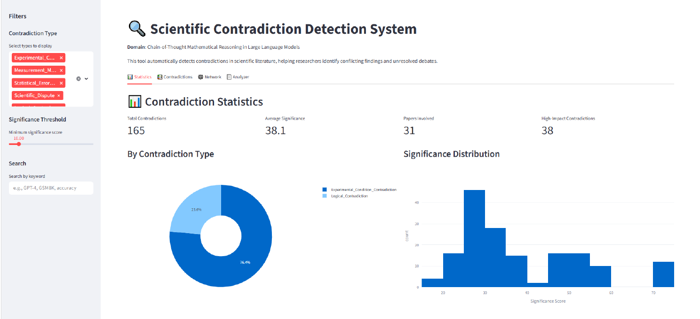
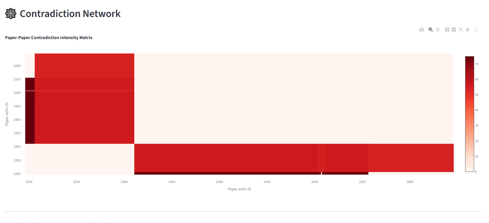

<p align="center">
  
  
  
  
</p>

# Scientific Contradiction Detection System

**An automated disagreement detector for the scientific record.**

It is not a literature review tool. It is not a summarizer. It scans hundreds of papers in a target domain, extracts structured claims, and surfaces where different papers reach opposing conclusions — producing a **Contradiction Map**: who disagrees with whom, about what, and why.

---

## The Problem: Academia's Blind Spot

A narrow subfield like Chain-of-Thought mathematical reasoning produced ~200 papers between 2021 and 2026. No researcher can read them all. Conflicting conclusions are published in different venues and never cross-referenced. Researchers build on inconsistent foundations without knowing it.

The system makes disagreement **measurable, structured, and queryable**.

---

## How It Works: Four-Phase Pipeline

```
┌──────────────────────────────────────────────────────────┐
│  1. DATA COLLECTION                                       │
│  arXiv + Semantic Scholar → 200 papers                   │
│  Rate-limited PDF download → PyMuPDF text extraction     │
│  (Results / Discussion / Conclusion sections only)        │
└───────────────────────┬──────────────────────────────────┘
                        │
                        ▼
┌──────────────────────────────────────────────────────────┐
│  2. CLAIM EXTRACTION                                      │
│  DeepSeek API / Llama 3 8B 4-bit                         │
│  → 6-tuple: subject | relation | object | condition      │
│              | evidence_type | confidence                 │
│  → DataCleaner: ontology normalization + synonym mapping  │
│  → 192 structured claims from 39 papers                  │
└───────────────────────┬──────────────────────────────────┘
                        │
                        ▼
┌──────────────────────────────────────────────────────────┐
│  3. CONTRADICTION DETECTION                               │
│                                                           │
│  Strategy 1: Same (subject, relation, object)             │
│    → Papers claim the same thing but conditions differ    │
│    → Experimental_Condition_Contradiction                 │
│                                                           │
│  Strategy 2: Same (subject, object), opposite relations   │
│    → "X improves Y" vs "X degrades Y"                    │
│    → Scientific_Dispute / Logical_Contradiction           │
│                                                           │
│  Classification: Rule engine (4 patterns) + LLM fallback  │
│  Significance: 0.6·log(citations) + 0.4·confidence(×10)  │
│  → 173 candidate pairs → 165 verified contradictions     │
└───────────────────────┬──────────────────────────────────┘
                        │
                        ▼
┌──────────────────────────────────────────────────────────┐
│  4. OUTPUT & INTERFACE                                    │
│  Streamlit dashboard (browse, filter, visualize)          │
│  LaTeX research paper (auto-generated)                   │
│  Manual verification CSV (top 100 sampled)               │
│  Rule engine from verified patterns                      │
└──────────────────────────────────────────────────────────┘
```

### Core Data Structure

Every claim is a strict 6-tuple. Contradictions are pairs of tuples from different papers.

| subject | relation | object | condition | evidence | confidence |
|---------|----------|--------|-----------|----------|------------|
| Chain-of-Thought | improves | Arithmetic Accuracy | GSM8K, GPT-3.5 | Experimental_Result | 5 |

---

## What We Found

| Metric | Value |
|--------|-------|
| Papers collected | 200 |
| Papers with extractable claims | 39 |
| Structured claims extracted | 192 |
| Candidate contradiction pairs | 173 |
| **Verified contradictions** | **165** |
| Papers involved | ~52 |

**165 contradictions, but only 24% are genuine scientific disputes.** The rest reveal a structural problem in the literature:

| Contradiction Type | Count | Meaning |
|-------------------|-------|---------|
| Experimental Condition | 126 (76%) | Same claim wording, different experimental setups |
| Logical Contradiction | 39 (24%) | Claims directly contradict each other |

This is **Condition Drift**: papers state "Chain-of-Thought improves arithmetic accuracy" while testing on GPT-3.5 vs Llama-2 vs GPT-4, GSM8K vs MATH vs SVAMP. The literature *appears* to agree but their experiments don't actually compare. This systematic inconsistency had not been previously documented at scale.

### Screenshots

| Statistics Dashboard | Contradiction Network |
|---------------------|----------------------|
|  |  |

---

## Quick Start

```bash
# Install
pip install -r requirements.txt

# Set your DeepSeek API key
set DEEPSEEK_API_KEY=sk-your-key-here          # Windows CMD
$env:DEEPSEEK_API_KEY = "sk-your-key-here"     # PowerShell
export DEEPSEEK_API_KEY=sk-your-key-here       # Linux/macOS

# Run full pipeline
python src/main.py --phase all

# Or step by step
python src/main.py --phase 1          # Data collection
python src/main.py --phase 2 --mock   # Claim extraction (test)
python src/main.py --phase 3          # Contradiction detection
python src/main.py --phase 4          # Paper generation

# Launch web interface
streamlit run src/app.py
```

### Individual Phase Scripts

```bash
python scripts/run_phase2.py          # Claim extraction via API
python scripts/run_phase2_batch.py    # Batch extraction (50 papers)
python scripts/run_phase3.py          # Contradiction detection
python scripts/run_phase3_final.py    # Final classification + paper
python scripts/run_phase4.py          # Paper generation only
python scripts/quick_test.py          # 10-paper test run
```

---

## Architecture Deep Dive

### Modules

| Layer | Module | Responsibility |
|-------|--------|----------------|
| **Data** | `paper_fetcher.py` | arXiv + Semantic Scholar metadata retrieval |
| | `pdf_downloader.py` | Rate-limited PDF download (15s interval) |
| | `text_extractor.py` | PyMuPDF text from Results/Discussion/Conclusion |
| **Extraction** | `claim_extractor.py` | 6-tuple extraction via LLM (DeepSeek or Llama 3) |
| | `data_cleaner.py` | Ontology normalization, synonym mapping |
| | `batch_processor.py` | Orchestrates extraction across all papers |
| **Detection** | `contradiction_detector.py` | Candidate generation + classification + scoring |
| | `rule_engine.py` | 4 rule patterns (opposite relations, dataset conflict, model comparison, statistical) |
| | `llm_client.py` | DeepSeek API abstraction with retry logic |
| **Output** | `paper_generator.py` | LaTeX paper auto-generation from results |
| | `app.py` | Streamlit web interface (4 tabs) |
| **CLI** | `main.py` | Phase orchestration (`--phase 1..4`) |

### Rule Engine (4 Patterns)

The rule engine handles classification without LLM inference, achieving zero hallucination for matched cases:

1. **Opposite relations** — Same subject/object, opposite relations → `Scientific_Dispute`
2. **Dataset conflict** — Same claim text, different datasets → `Experimental_Condition_Contradiction`
3. **Model comparison** — Same claim, different LLM models → `Experimental_Condition_Contradiction`
4. **Statistical disagreement** — Numerical values differ by >10% → `Statistical_Error_Contradiction`

### Significance Scoring

```python
significance = 0.6 * log1p(avg_citations) * 10 + 0.4 * avg_confidence * 10
```

Uses log-scaled citations to prevent a single high-citation paper from dominating the ranking.

### Configuration

```yaml
# config.yaml
data:
  search_query: "chain of thought mathematical reasoning"
  max_papers: 200
  start_year: 2021

model:
  name: "meta-llama/Meta-Llama-3-8B-Instruct"
  temperature: 0.05

scoring:
  citation_weight: 0.6
  confidence_weight: 0.4
```

---

## Adapting to a Different Domain

This system is domain-agnostic. To apply it to another scientific field:

1. **Define ontology** — `src/ontology.py`: replace `concepts`, `relations`, `synonym_map`
2. **Set search query** — `config.yaml` → `data.search_query`
3. **Run** — `python src/main.py --phase all`

Requirements: a formalizable vocabulary (~10 concepts, ~10 relations), a searchable corpus of 150–500 papers.

---

## Comparison

| Dimension | Traditional Review | This System |
|-----------|-------------------|-------------|
| Papers reviewed | 20–50 (manual) | 200+ (automated) |
| Claims representation | Mental model | Structured 6-tuple |
| Contradiction detection | Human memory | Rule engine + LLM |
| Impact weighting | Subjective | Citation × confidence |
| Reproducibility | None | Dataset + code published |
| Reusability | One-time publication | Re-runnable pipeline |

---

## Roadmap

### Completed
- [x] Data collection (ontology, fetch, PDF, text extraction)
- [x] Claim extraction (6-tuple, normalization, batch)
- [x] Contradiction detection (candidates, classification, scoring, rule engine)
- [x] Output (Streamlit, LaTeX paper, manual verification)

### Planned
- [ ] Automated rule derivation from verified contradictions
- [ ] Cross-domain expansion (swap ontology → new field)
- [ ] Continuous arXiv monitoring
- [ ] Rule engine coverage >90%

---

## Citation

```bibtex
@software{contradiction_detector,
  title = {Scientific Contradiction Detection System},
  author = {Fengrru},
  year = {2026},
  url = {https://github.com/Fengrru/scientific-contradiction-detector}
}
```

## License

MIT License — Open source for academic and research use.

## Acknowledgments

- Methodology: Hassabis Alpha-series scaffold approach (narrow domain → world model → open science)
- LLM pipeline: Sakana AI Scientist
- Domain expertise: Chain-of-Thought mathematical reasoning literature

---

> This system transforms scientific literature from a silent archive of disconnected findings into a **Contradiction Map** — making disagreement visible, measurable, and actionable.
